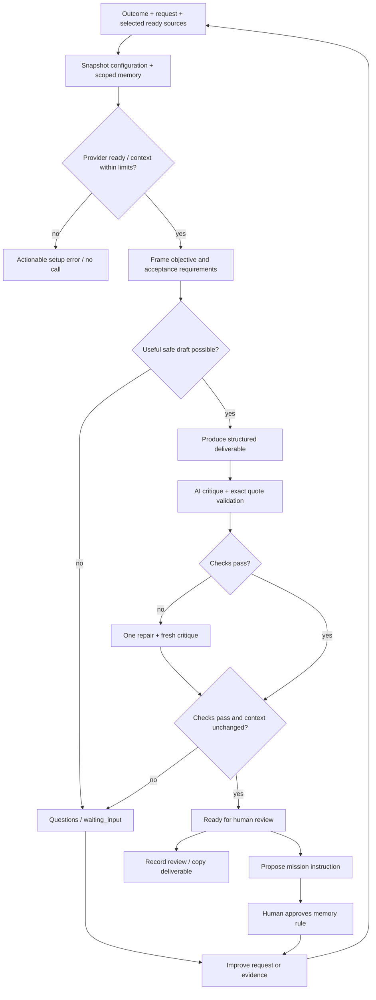

# Orbis mission runtime — implemented slice and next gates

Status: local, operator-controlled pilot. Updated 2026-09-09.

## Product contract

A company installs a mission, not a graph editor. The operator supplies an outcome, evidence and instructions. The system prepares a reviewable artifact and makes uncertainty visible. Knowledge and approved memory are shared inputs to a repeatable contract, not an unconstrained chat history.

Four supported contracts use the same workbench:

| Mission             | Useful output                                | Critical boundary                                 |
| ------------------- | -------------------------------------------- | ------------------------------------------------- |
| Customer request    | Needs, constraints, prepared reply           | No invented prices, availability or commitments   |
| Meeting preparation | Evidence-based brief, agenda, questions      | No invented biography or conversation history     |
| Research brief      | Evidence comparison, uncertainty, next step  | Supplied sources only; no live web search         |
| Content draft       | Main draft, two variants, factual references | No invented metrics, testimonials or capabilities |

Other catalog entries remain discoverable, but the live engine rejects unsupported contracts. This is a horizontal substrate with explicit supported outputs, not a claim to automate every department.

## Functional graph

There are no email/CRM writes, browser tools, purchases or self-created service accounts in this runtime. An approval button cannot fabricate an execution. Continuous activation is deliberately blocked until a worker and connectors exist.

## Implementation map

| Component                                          | Responsibility                                                                               |
| -------------------------------------------------- | -------------------------------------------------------------------------------------------- |
| `src/components/missions/MissionStudio.tsx`        | Editable input, live polling, trace, artifacts, evidence, history, feedback, memory approval |
| `src/app/(workspace)/missions/[id]/setup/page.tsx` | Outcome/source/instruction configuration with validated save                                 |
| `src/lib/runtime/contracts.ts`                     | Mission contracts, structured schemas, deterministic quote checks, memory filtering          |
| `src/lib/runtime/agent-engine.ts`                  | Bounded execution, context fingerprint, idempotency, transitions, persistence                |
| `src/lib/runtime/provider.ts`                      | Server-only provider construction; public status excludes secrets                            |
| `src/lib/runtime/engine.ts`                        | Mission creation, immutable-result feedback, blocked external actions                        |
| `src/lib/store/store.ts`                           | Local snapshot storage, clone-before-mutate, atomic rename, interrupted-run expiry           |

SDK adapters are reused. Orbis owns the mission contracts, operator experience, evidence chain and quality gates. It does not recreate an LLM client, general agent framework or Markdown renderer.

## API behavior

| Endpoint                                | Contract                                                                                                            |
| --------------------------------------- | ------------------------------------------------------------------------------------------------------------------- |
| `GET /api/v1/runtime`                   | Provider/model/configuration status; no key values                                                                  |
| `PATCH /api/v1/missions`                | Validated draft changes; ready sources from current workspace; test mode only; invalidates mission readiness        |
| `POST /api/v1/missions/:id/test-runs`   | 10–20,000 character input; optional case; test-only; optional Idempotency-Key; local same-origin guard              |
| `POST /api/v1/evaluations/:id/feedback` | Feedback does not overwrite the artifact; accepted review requires passing live evaluation of current configuration |
| `PATCH /api/v1/memory/:id`              | Approve/remove a mission-scoped instruction                                                                         |
| `GET /api/v1/workspace`                 | Polling snapshot; also expires interrupted live runs after three minutes                                            |

Run submission currently waits for completion; the workspace is polled every two seconds to show persisted steps. A page reload resumes polling an in-progress run. A retry key replays the original result without additional provider calls; reuse with different input/configuration is rejected. A fresh key is an intentional new attempt and can incur another charge.

This idempotency is **single-process only**. It is not distributed locking, exactly-once execution or a payment guarantee. The in-memory cache and JSON file must not be shared between application replicas.

## Quality and safety invariants

- One ready-source context, explicitly selected for the mission and filtered by workspace tenant ID. No automatic fallback to every document.
- Snapshot hash covers package/version, full mission configuration, selected source contents/versions, approved workspace instructions, scoped memory, provider/model and engine version.
- A context change during execution fails the gate. A changed configuration cannot reuse an old human-review acceptance.
- A citation passes quote integrity only when its exact text occurs in the named selected source. That is not proof of entailment; semantic grounding remains an AI judgment.
- Critical checks must all pass; an average score cannot hide one failing critical check.
- Source content is treated as untrusted data in model instructions. This is defense in depth, not a proof against prompt injection. No callable tools are exposed in this slice.
- Proposed memory does not enter context. Approved general rules apply only to the originating mission. Result-only notes do not leak into future jobs. Customer-scoped promotion is refused without a verified customer identity.
- The artifact is preserved when feedback is submitted. A retest produces a new run/artifact/evaluation.
- No fabricated euro amount is recorded as live usage. Successful step token counts come from SDK usage. Incomplete/failed calls can incur unrecorded usage: the provider remains the billing authority.
- Failures preserve a failed run and step, expose an actionable generic error, and do not echo raw provider payloads or credentials.

## Runtime limits

| Limit                           | Enforcement                                                   |
| ------------------------------- | ------------------------------------------------------------- |
| 5 model calls                   | Fixed graph: frame, draft, review, optional repair and review |
| 1 repair                        | Explicit conditional branch, no recursive agent loop          |
| 2,400 output tokens/call        | SDK `maxOutputTokens`                                         |
| 65,000 context characters       | Preflight JSON length guard; not tokenizer-accurate           |
| 150 seconds                     | Shared abort signal across model calls                        |
| No implicit retries             | SDK `maxRetries: 0`                                           |
| 1 active run/workspace          | Local in-process check; not a distributed semaphore           |
| 3-minute interrupted-run expiry | Workspace polling marks stale runs failed                     |

No monetary cap is enforced. The same selected context is resent across steps; prompt caching may depend on provider behavior and is not asserted. Planner/reviewer currently use the same model with distinct instructions, not independently calibrated models. A model can still produce poor or unsupported work. Evaluation thresholds need a real dataset before production claims.

## Verification and current evidence

Automated tests use a mocked SDK and an isolated seeded store. They cover success, input-needed routing, bounded repair, provider errors, token aggregation, context-change invalidation, retry deduplication, citation integrity, memory scope, preservation of artifacts and blocked external execution. Local request guards are tested separately.

Manual browser checks cover desktop/mobile layout, no horizontal overflow at 390px, evidence navigation, configuration fields and provider-missing refusal. TypeScript and webpack production builds are validated. **A paid live-provider run has not been validated in this environment because no provider is configured.** These tests do not establish model quality, operational security or scalability.

## Fastest route to an enterprise pilot

Do not add more agents before these gates. Keep the four contracts while hardening shared infrastructure.

1. **Live calibration:** operator supplies a restricted provider key; run 10–20 representative anonymized cases per contract. Store versioned expected constraints and human ratings. Gate on unsupported-claim rate, completeness, useful-result rate, latency and actual cost. Test both supported providers; never infer compatibility from mocked SDK calls.
2. **Identity/data isolation:** adopt an existing OIDC product and PostgreSQL; derive tenant from server sessions on every request; enforce row isolation and authorization on sources, memory, runs and exports. Eliminate demo reset from production. Add encrypted secrets via a managed vault and per-tenant provider references.
3. **Durable orchestration:** choose an existing durable job system (evaluate Temporal or a managed workflow service against deployment constraints). Persist run/step state in Postgres, use transactional idempotency keys, leases, retries by error class, cancellation and concurrency quotas. Keep the current contract layer independent of the queue.
4. **Knowledge:** adopt connector/ingestion infrastructure; preserve ACLs and provenance; introduce retrieval budgets, freshness, source revocation and deletion propagation. Add source snapshots for reproducible historical review rather than relying on a hash alone.
5. **Cost and quality routing:** version model policies, price tables and evaluation datasets. Introduce a low-cost planner only after quality comparisons; reserve worst-case cost before calls and reconcile provider usage afterward. Never silently route confidential material to another provider.
6. **First real external connector:** reuse OAuth infrastructure (e.g. Nango/Composio after security fit checks). Add one typed action behind payload-hash approval, idempotent adapter, audit event and receipt verification. Do not label uncertain outcomes succeeded. Only then enable supervised scheduling.

Acceptance for a pilot is not “the workflow ran”: a new operator must configure one of the four missions, understand what data leaves the workspace, obtain a useful result, inspect evidence, correct behavior and repeat the result without developer intervention. Measure onboarding time and result quality separately; five-minute setup is a target, not a claim established by this slice.
