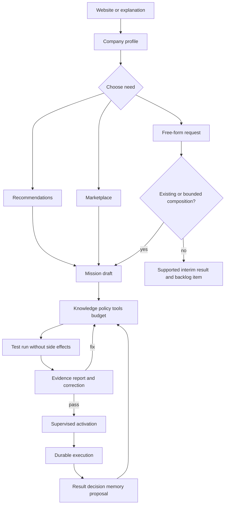

# Functional flows

## Main flow

## State machines

Mission: `draft → configuring → testing → ready → active → paused → archived`.

Run: `queued → running → waiting_input | waiting_approval | succeeded | failed | cancelled | needs_reconciliation`.

External action: `planned → policy_checked → approval_required → approved → executing → succeeded | failed | uncertain`.

An uncertain external action never retries blindly. The system queries the provider or asks for reconciliation.

## Activation checks

The server checks membership, package version, configuration version, mandatory knowledge, evaluation status, permissions, approval policy, budget reservation and current connection health. The client cannot set an active flag directly.

## Correction flow

The user edits a result. The system asks whether the correction applies to this result, this customer or a general rule. It stores the example, proposes memory or policy changes, runs regression tests and requires explicit approval before changing active behavior.

## Connector flow

OAuth or API key begins from a user-authorized connection, stores secrets server-side, lists scopes before consent and maps provider records into common objects. Revocation suspends dependent missions and reports whether the provider confirmed revocation.
